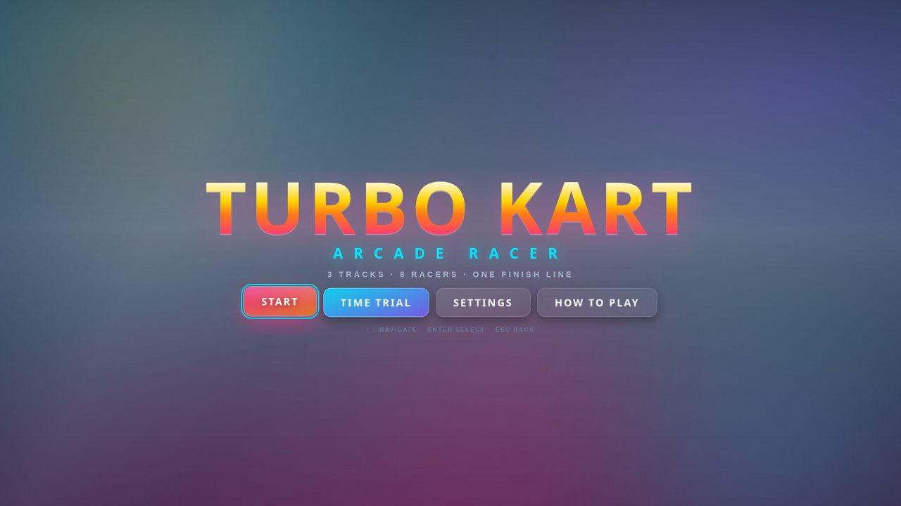
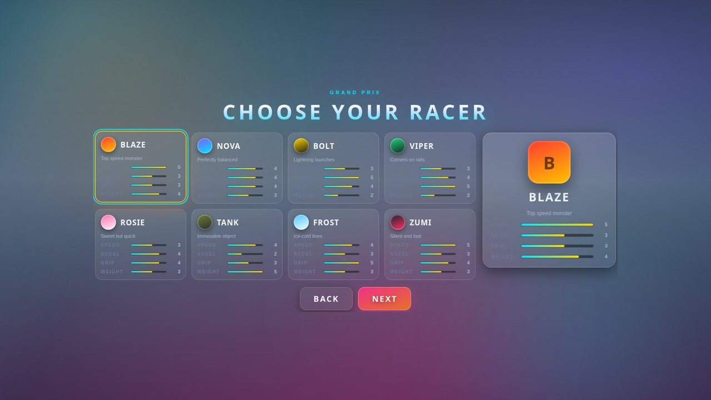
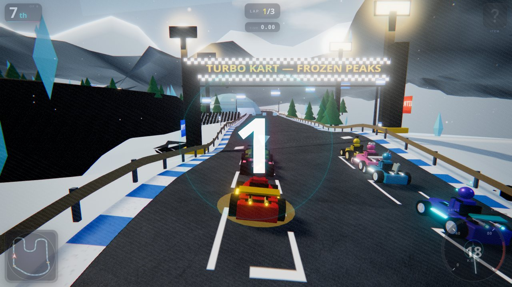
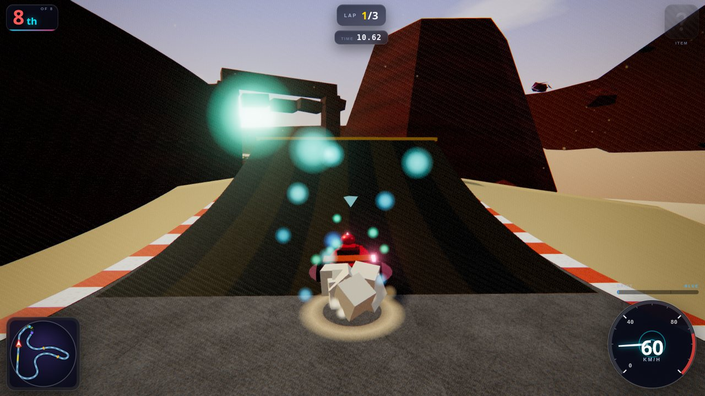
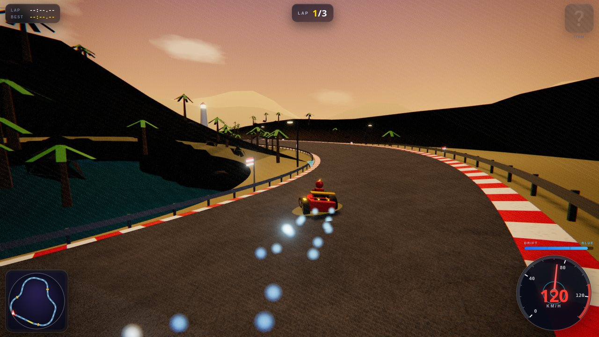
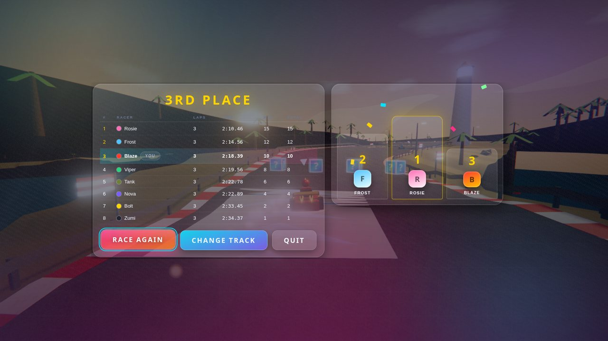

# 🏎️ Turbo Kart

An arcade kart racer built with **Three.js** — 8 racers, 3 tracks, 8 items, drift
mini-turbos, AI opponents, synthesized audio and a full presentation layer. No
external assets: every mesh, texture and sound is generated procedurally at runtime.

```bash
npm install
npm run dev        # http://127.0.0.1:5173
npm run build      # production bundle in dist/
npm run preview    # serve the production bundle
npm run smoke      # headless structural + race-simulation regression suite
```

## Gallery

| | |
|---|---|
|  |  |
|  |  |
|  |  |

*(All captured from the real build in headless Chrome — see `docs/screenshots/`.)*

## Controls

| Action | Keyboard | Gamepad | Touch |
|---|---|---|---|
| Accelerate | `W` / `↑` | RT / A | right pedal |
| Brake / reverse | `S` / `↓` | LT / B | left pedal |
| Steer | `A` `D` / `←` `→` | left stick / D-pad | bottom-left pads |
| Drift / hop | `Space` / `Shift` | X / Y | drift button |
| Use item | `E` / `Ctrl` | RB / LB | item button |
| Look back | `Q` | Y / △ | — |
| Pause | `Esc` | Start | pause button |
| Respawn | `R` | Select | — |

**Drift**: hold drift while steering at speed to hop into a slide. Charge through
three stages (blue → orange → purple) and release for a mini-turbo.
**Rocket start**: press throttle in the last ~0.35 s of the countdown.

## Features

- **Racing**: 8 karts, 3 laps, checkpoint-validated lap counting, live standings,
  position-change feedback, final-lap callouts, GP points, time-trial mode with
  best-lap tracking, rubber-banded AI with 4 difficulty tiers and per-character
  personalities.
- **Driving model**: stat-driven acceleration/top speed/grip/weight, drift with
  3-stage mini-turbos, slipstream, off-road penalties, ramps with ballistic air
  time, boost pads, ice patches, kart-vs-kart collisions, spin-outs, squash,
  invincibility, respawn rescue, rocket starts.
- **Items**: mushroom, triple mushroom, banana, green shell, red shell, triple
  shells, star, lightning — with place-weighted roulette, dropped hazards,
  homing/ bouncing projectiles, orbital shells, shields/blocking and a hazard
  feed the AI reacts to.
- **Tracks**: *Sunset Speedway* (coastal sweepers), *Desert Dunes* (canyon ramps),
  *Frozen Peaks* (alpine ice + tunnel/bridge) — hand-authored splines with
  elevation and banking, procedural road/kerb/rail/gate geometry, themed
  environments (sky, terrain, water, weather, crowds, landmarks).
- **Presentation**: chase/hood/far cameras with speed FOV, shake and look-back;
  speedometer, minimap, lap/position/item HUD, drift meter; full menu flow
  (title → mode → character → track → difficulty), pause + live settings,
  results with podium; bloom/vignette/aberration/grain post-processing; particle
  FX for drift, dust, boosts, impacts, lightning and confetti.
- **Audio**: fully synthesized WebAudio — engine tone tied to speed/surface,
  skids, mini-turbo whooshes, item sounds, countdown, fanfares and per-theme
  procedural music with crossfades.
- **Quality presets** (`low` → `ultra`) scale shadows, pixel ratio, particle
  budgets, environment density and post-processing. Post FX falls back to a plain
  render if the composer cannot be created — never a black screen.

## Architecture

```
src/
  contracts.js        frozen contract: events, characters, tracks, items, typedefs
  main.js             integrator: game states, race lifecycle, frame loop
  core/               engine (renderer/camera/quality), input (KB/gamepad/touch), rng
  kart/               arcade physics, kart+driver meshes, models
  track/              track data, spline builder + O(1) projection, environment, props
  ai/                 racing line, pure-pursuit driver, personalities, rubber-banding
  race/               race manager, checkpoint lap tracking, progress/standings
  items/              item system, projectiles, meshes
  ui/                 HUD, menus, minimap, styles
  audio/              WebAudio synth + procedural music
  fx/                 particle systems, post-processing chain
tests/                headless smoke + integration race simulation
tools/                orchestrator QA harness (headless Chrome) + probes
docs/                 conventions, agent reports, QA runbook
```

Subsystems communicate through a shared event bus (`src/core/events.js`) using the
event names in `src/contracts.js`; nothing imports another subsystem's runtime
modules. That kept five parallel workstreams integrable.

## Verification

- `npm run smoke` — module inventory, syntax, exports, contract integrity, import
  resolution, banned patterns, ownership audit, FX behaviour and a **headless
  4-minute 8-kart race simulation** (laps, items, hits, results).
- `node tools/browser-qa.mjs --auto --gpu --seconds 20` — headless Chrome run:
  menu walk, autopilot, telemetry (fps, speed, laps, standings), screenshots,
  console/error capture. See `tools/QA_RUNBOOK.md`.
- Measured on an Intel UHD iGPU at 1600×900: ~50 fps at `high`, ~70 fps in time
  trial; ~52 fps average over a full 3-lap race with items and FX.

## Known gaps

- Guardrails are a soft lateral limit rather than collision geometry.
- Spin-outs are visual (mesh rotation + speed loss) rather than heading changes.
- `antialias` (MSAA) is fixed when the renderer is created, so it cannot be
  toggled live from the quality menu.
- Grand Prix is a single race per session (points shown, no multi-race cup yet).
